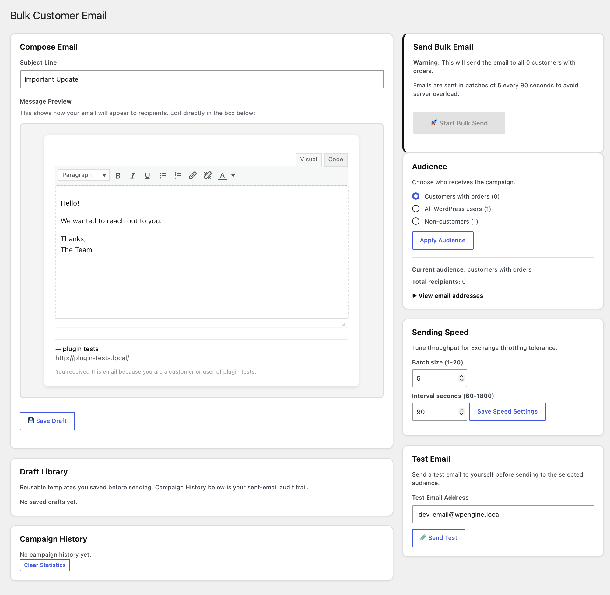

# Bulk Customer Email for WooCommerce

A simple, lightweight plugin for sending email campaigns to WooCommerce customers and WordPress users.

**Free software. No subscription. No license fee. No nonsense.**

## Requirements

- WordPress
- WooCommerce
- A working WordPress mail configuration

**WooCommerce is required.** The plugin uses WooCommerce order data to identify customers.

## Installation

1. Upload the plugin through **Plugins → Add New → Upload Plugin**, or place it in `wp-content/plugins/`.
2. Activate **Bulk Customer Email for WooCommerce**.
3. Open **WooCommerce → Bulk Email**.

## Using the Plugin

### Configure your email identity

Set your brand/site name, website URL, from name, from email, logo, and footer text. Blank fields use sensible WordPress defaults.

The plugin sends through WordPress `wp_mail()`; it is not an SMTP service.

### Choose your audience

You can send to customers with orders, all WordPress users, or non-customers. Review the recipient list before sending.

### Compose and test

Write your subject and message, optionally save a draft, and send a test email before starting the campaign.

### Send

The plugin uses small batches and delays between them to reduce server load.

Default rate:

- **5 emails per batch**
- **90 seconds between batches**

The campaign runs through scheduled WordPress events rather than trying to send the entire list in one request.

## Important Notes

You are responsible for using this plugin in accordance with applicable email, privacy, and anti-spam laws and your own policies.

This is a simple sending utility, not a replacement for a full email-marketing platform. It does not provide subscriptions, automation, advanced analytics, tracking, or dedicated email infrastructure.

## A Note from the Author

I made this because I needed a simple solution to a simple problem. I couldn't see any good reason for a tool like this to require a subscription or license fee.

**So I'm giving it away.**

Use it. Modify it. Improve it. Fork it. Share it.

The GPL permits people to charge for distributing GPL software, and that is their right. But selling this plugin is not what this project is intended for, and it is not something I endorse.

I'd much rather see someone improve a useful little tool and give those improvements back to the community than turn it into another subscription.

## License

This plugin is licensed under the **GNU General Public License v3.0 (GPL-3.0-only)**.

See the `LICENSE` file for the full license.

## Contributing

Bug fixes, security improvements, compatibility fixes, and sensible improvements are welcome. Please keep the plugin simple and focused.
